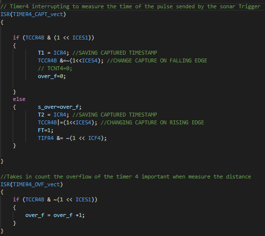

# Balance Fontol of a Ball

###### By: Pedro Rossa

## Introduction

The objective of this project is to balance a ball on a platform (1D movement) and if the ball is moved to a different position which is not the middle(by default de desired position) of the board the machine should return it to the middle.

To do this was used an Arduino MEGA 2560, a servo motor to move the platform, sonar to detect the position of the ball and some buttons to facilitate the adjuste in the begining of the operation, saving data and stop and start the machine.

It is possible to see the angle at which the platform is at run time due to a 4-digit, 7-segment LED display.

## Components of the project
In this section are the list of all componets used to do this project and the corresponding datasheet.
### Microcontroller
[Arduino MEGA 2560](https://ww1.microchip.com/downloads/en/devicedoc/atmel-2549-8-bit-avr-microcontroller-atmega640-1280-1281-2560-2561_datasheet.pdf) [(Scheme)](https://github.com/meft-sad/Balance_Control_of_a_Ball/blob/master/Manuals/Arduino_mega.png);
### Inputs 
Buttons;
### Outputs
[HDSP-B0xE](http://www.farnell.com/datasheets/2095876.pdf) :  Four digit seven segment display;

### Sensors
The sensors used in this project and corresponding datasheet are:
* [HC-SR04](https://cdn.sparkfun.com/datasheets/Sensors/Proximity/HCSR04.pdf) : Sonar to measure distances;
* [SG90](http://www.ee.ic.ac.uk/pcheung/teaching/DE1_EE/stores/sg90_datasheet.pdf) : Servo motor;
* [MPU-6050](https://cdn.sparkfun.com/datasheets/Sensors/Accelerometers/MPU-6050.pdf) : Accelerometer and gyroscope module 3 axes.

## Explaning the non-trivial components

### [HC-SR04](https://cdn.sparkfun.com/datasheets/Sensors/Proximity/HCSR04.pdf) : Sonar to measure distances

In order to measure the position of the ball in the platform it was used the HC-SR04. This sensor measures the time of the a ultrasound impulse that it emits by the Trigger, travels in the air and it’s reflected by an object, in this case a ball, and arrive to the Echo. By using the time of the ultrasound traveled and the speed of sound in the air it&#39;s possible to measure the distance.

The sonar HC-SR04 has 4 pins: Vcc, Trigger, Echo, Ground. To put it working is needed to connect 5V to Vcc and ground to the Ground pin. To the Trigger it must supplied a short 10uS pulse to start the ranging and wait 60 ms, for the wave has time to travel back to the sensor before sending another pulse, and then the module will send out an 8 cycle burst of ultrasound at 40 kHz.

The Echo pin it should be connect to an input pin of the microcontroller, because in this pin after the wave is reflect on the ball the Echo pin goes high for a particular amount of time, which will be equal to the time taken for the wave to return back to the sensor. In the microcontroller will be use an Input Capture Mode.

#### Input Capture Mode

It was used the Timer 4 of the Arduino Mega 2560 wich is a 16-bits timer and it was configured with the mode Input Capture, so this timer is able to capture external evets and give the time at they ocur. With this in mind it was connected the Echo of the sonar to the Pin 49 (PL0) of the Arduino, that pin corresponds to
the Interrupt of timer 4 (ICP4).

Initially the Input Capture is sensitive to rising flank because is expected the beam of the reflect wave. Then the time of the ICR4 is saved in a variable (in this cases T1) and then the sensing mode is changed to falling flank waiting for to the wave ends and again saving the time in a variable (T2). By doing T2-T1 we would expect the time of the wave traveling to the object them being reflected and arriving to the Echo but the timer could have overflowed between the measurements. To overcame this problem, it was added an overflow interruption that corrects for this, as you can see in the following piece of code.

The time is given by &quot;duration = T2-T1+65535*s_over&quot; where s_over is all the time 0 but if an over fall occurs between T1 and T2 it's going to be 1.

#### Calculation of distance

To get the distance we need to multiply the time that the wave travels by the speed of sound in the air and divide it by 2 because the wave travels the double of the distance of ball position, so:

distance = (duration * speed_sound)/2

The speed of sound is 340 m/s to convert it to units that are used on the Arduino, such as microsecond, the speed of sound is equal to 0.0340 [cm/us] (29 [us/cm]) and since we are using the timer 4 with no prescaler the duration 
needs to be converted to microseconds, so duration*1/16 [us], so the final calculation is:

distance[cm] = durantion/(29 * 2 * 16) = durantion/928

### [SG90](http://www.ee.ic.ac.uk/pcheung/teaching/DE1_EE/stores/sg90_datasheet.pdf) : Servo motor 

### [MPU-6050](https://cdn.sparkfun.com/datasheets/Sensors/Accelerometers/MPU-6050.pdf) : Accelerometer and gyroscope module 3 axes

### [HDSP-B0xE](http://www.farnell.com/datasheets/2095876.pdf) :  Four digit seven segment display

To work with this type of display it is needed to send to the HDSPBOxE 12 outs so for that purpose was created the following table to help control the display:

And after that using the ABC... scheme showed above it was code the bit of the prots PF0 to PF7 to write the numbers:

# PID
# Test of the code 
In the following gif is showing one of the test done of the machine working and as you can see the objective of balance a ball and keep it in the middle is achieved.

# Analise of Data

